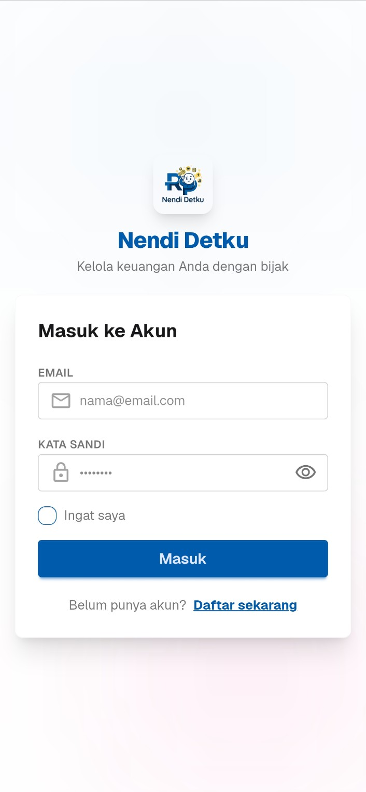
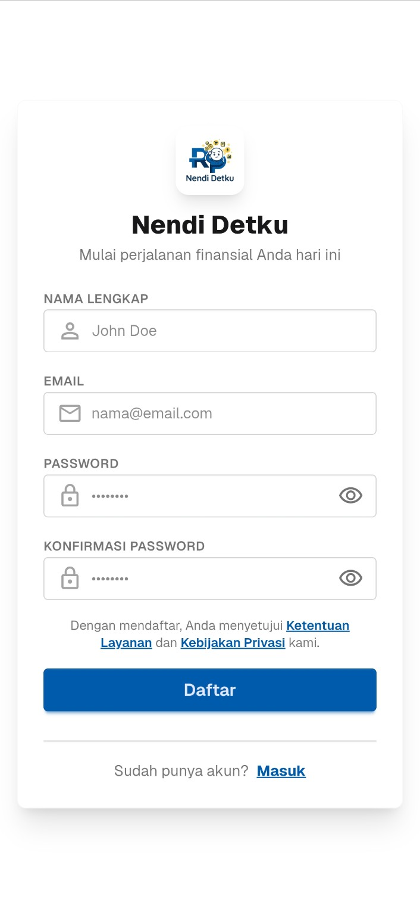
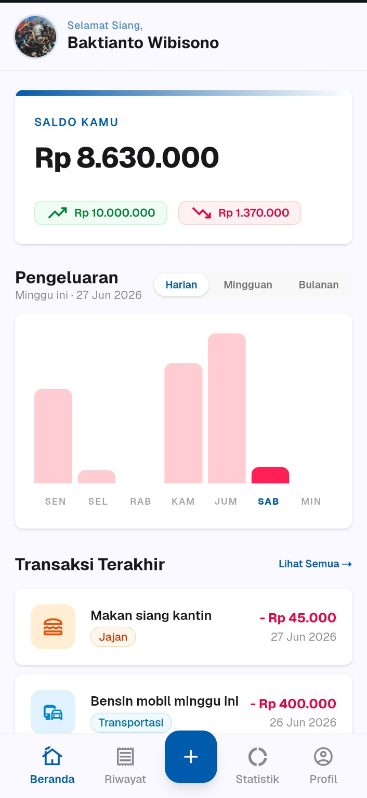
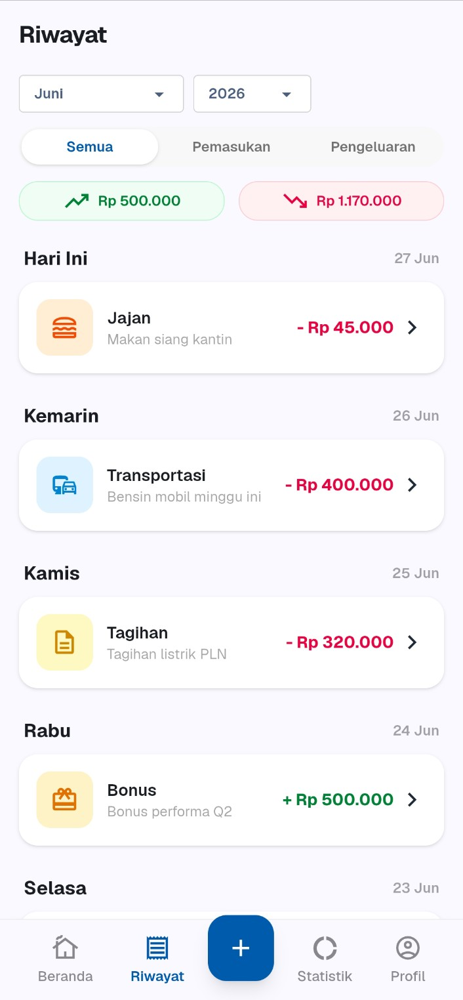
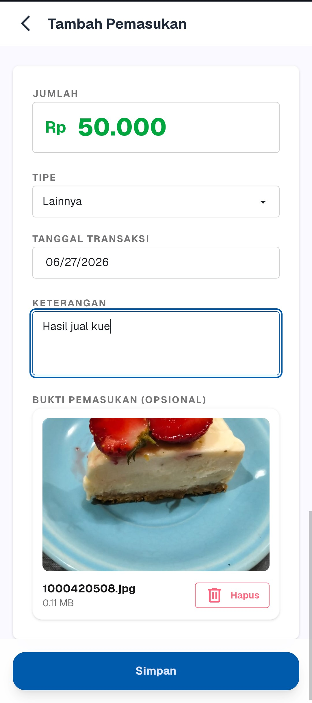
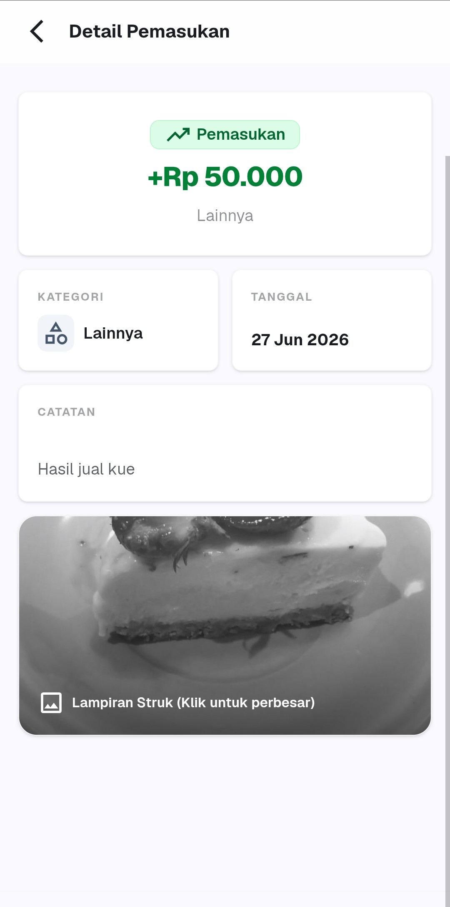
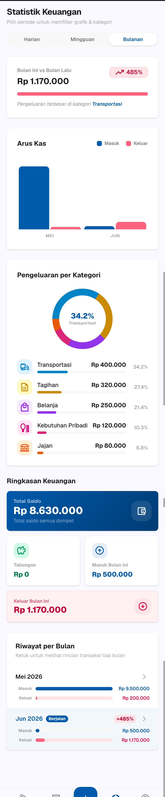
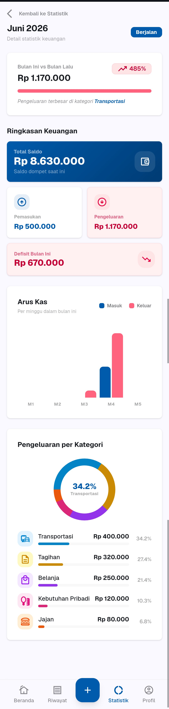
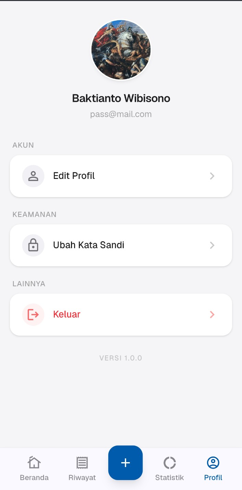

# 💰 Nendi Detku

Aplikasi pencatatan keuangan pribadi berbasis web dengan tampilan mobile-first.

> "Kelola keuangan Anda dengan bijak"

---

## 📸 Screenshot

| Login | Register | Beranda |
|-------|----------|---------|
|  |  |  |

| Riwayat | Tambah Transaksi | Detail Transaksi |
|---------|------------------|-------------------|
|  |  |  |

| Statistik | Statistik Detail | Profil |
|-----------|-------------------|--------|
|  |  |  |

---

## 🛠️ Tech Stack

| Teknologi | Keterangan |
|-----------|-------------|
| [Laravel](https://laravel.com) | Backend framework (PHP) |
| [Livewire](https://livewire.laravel.com) | Reactive component tanpa perlu menulis JavaScript penuh (SPA-like experience) |
| [Tailwind CSS](https://tailwindcss.com) | Utility-first CSS framework untuk styling |
| [DaisyUI](https://daisyui.com) | Component library berbasis Tailwind CSS |
| MySQL | Database |
| Laragon | Local development environment |

---

## 📐 Desain & UI/UX

- **Mobile-first design** — seluruh tampilan dioptimalkan untuk layar smartphone
- Bottom navigation bar dengan 5 menu utama: **Beranda, Riwayat, Tambah (+), Statistik, Profil**
- Skema warna utama: biru (`#1E5FBF`-ish) untuk elemen primer, hijau untuk pemasukan, merah/pink untuk pengeluaran
- Card-based layout dengan rounded corners dan shadow lembut
- Grafik interaktif menggunakan chart (bar chart & donut chart) untuk visualisasi data keuangan

---

## 🚀 Instalasi

```bash
# Clone repository
git clone https://github.com/taufiqlhm2u/nendi-detku.git
cd nendi-detku

# Install dependency PHP
composer install

# Install dependency JS
npm install

# Copy file environment
cp .env.example .env

# Generate application key
php artisan key:generate

# Konfigurasi database di .env
# DB_DATABASE=nendi_detku
# DB_USERNAME=root
# DB_PASSWORD=

# Jalankan migrasi database
php artisan migrate

# (Opsional) Jalankan seeder
php artisan db:seed

# Build asset frontend
npm run dev

# Jalankan server
php artisan serve
```

Aplikasi dapat diakses melalui `http://localhost:8000` atau melalui `Laragon` di `http://nendi-detku.test`.

---

## 📝 Lisensi

Proyek ini dibuat untuk keperluan pembelajaran/pribadi. Silakan gunakan dan modifikasi sesuai kebutuhan.

---

## 👨‍💻 Pengembang

Dikembangkan dengan ❤️ menggunakan Laravel + Livewire + Tailwind CSS + DaisyUI.